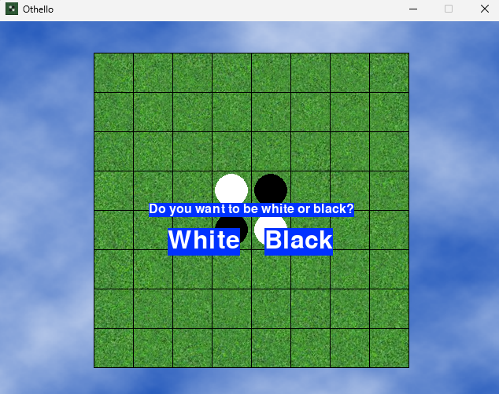
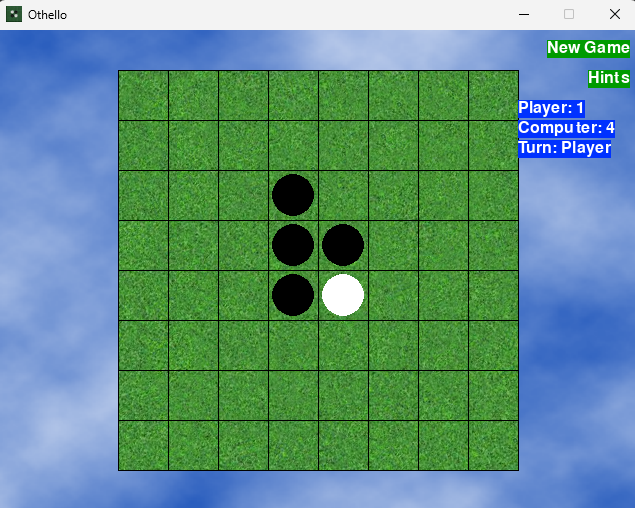
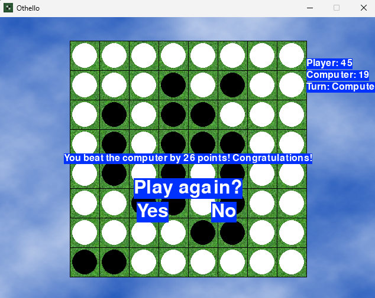

[](https://github.com/ShivamKR12/Flippy/actions/workflows/build.yml)
[](https://github.com/ShivamKR12/Flippy/releases)

# Flippy

**Flippy** is a faithful implementation of the classic Reversi (also known as Othello) board game, developed in Python using the Pygame-CE library. Challenge yourself against a computer opponent featuring a simple AI strategy, and enjoy smooth gameplay with intuitive controls and visual feedback.

## Table of Contents

- [Features](#features)
- [Screenshots](#screenshots)
- [Requirements](#requirements)
- [Installation](#installation)
- [How to Play](#how-to-play)
- [Game Rules](#game-rules)
- [Controls](#controls)
- [Project Structure](#project-structure)
- [Development](#development)
- [Credits](#credits)
- [License](#license)

## Features

Flippy offers a complete and engaging Reversi experience with the following key features:

- **Player Choice**: Select to play as either White or Black tiles, allowing for strategic flexibility.
- **AI Opponent**: Face off against a computer player that employs random move selection for unpredictable gameplay.
- **Hint System**: Enable visual hints to highlight all valid moves, perfect for beginners or strategic planning.
- **Smooth Animations**: Enjoy fluid tile-flipping animations that bring the game to life.
- **Real-Time Feedback**: Track scores and current turn with an on-screen display.
- **Game Management**: Easily start a new game at any time to practice or replay.
- **Cross-Platform Executable**: Download a standalone executable that runs without requiring Python or additional dependencies.

## Screenshots



*Main game interface showing the board and controls.*



*Gameplay in progress with tiles placed.*



*Endgame state displaying final scores.*

## Requirements

### For Running from Source
- **Python**: Version 3.6 or higher
- **Pygame-CE**: Install via `pip install pygame-ce`

### For Standalone Executable
- No additional requirements – the executable is self-contained and ready to run on compatible systems.

## Installation

### Option 1: Run from Source Code

1. **Clone the Repository**:
   ```bash
   git clone https://github.com/ShivamKR12/Flippy.git
   cd Flippy
   ```

2. **Install Dependencies**:
   ```bash
   pip install pygame-ce
   ```
   *Note: It is recommended to use a virtual environment to avoid conflicts with other Python projects.*

3. **Launch the Game**:
   ```bash
   python flippy.py
   ```

### Option 2: Use Standalone Executable

1. Visit the [Releases](https://github.com/ShivamKR12/Flippy/releases) page on GitHub.
2. Download the latest executable file for your operating system.
3. Run the executable directly – no installation or additional setup required.

## How to Play

Reversi is a strategy board game where players compete to control the most tiles on an 8x8 grid. Follow these steps to get started:

1. **Select Your Color**: Choose to play as White or Black at the beginning of the game.
2. **Make Your Move**: Click on an empty square on the board to place your tile. Valid moves will flip one or more of your opponent's tiles.
3. **Use Hints**: Toggle the hint system to see all possible valid moves highlighted on the board.
4. **Strategic Goal**: Aim to have more tiles of your color than your opponent when the game ends.
5. **Game End**: The game concludes when neither player can make a valid move. The player with the most tiles wins.

### Tips for Beginners
- Focus on corner positions, as they are the most valuable and hardest for opponents to flip.
- Avoid placing tiles near the edges unless necessary, as they can be easily surrounded.
- Use the hint system to learn valid moves and develop your strategy.

## Game Rules

Flippy adheres to the standard rules of Reversi/Othello:

- **Board Setup**: The game begins on an 8x8 board with four tiles placed in the center: two black and two white in a diagonal pattern.
- **Turns**: Players alternate turns, starting with Black. On your turn, you must place a tile that captures at least one of your opponent's tiles.
- **Capturing Tiles**: A move is valid if it sandwiches one or more opponent tiles between your new tile and another of your tiles (horizontally, vertically, or diagonally). All sandwiched tiles flip to your color.
- **Passing**: If a player has no valid moves, they must pass their turn. The game continues until both players pass consecutively.
- **Winning**: The player with the most tiles of their color at the end wins. Ties are possible but rare.
- **Game End**: The game ends when the board is full or no valid moves remain for either player.

For a complete ruleset, refer to the official Othello rules.

## Controls

- **Mouse Click**: Place tiles on the board or interact with on-screen buttons.
- **ESC Key**: Exit the game immediately.
- **Hints Button**: Toggle the display of valid move highlights.
- **New Game Button**: Reset the board and start a fresh game.

## Project Structure

The repository contains the following key files:

- `flippy.py` - Main game source code implementing the game logic, AI, and user interface.
- `flippy.spec` - PyInstaller specification file for building the standalone executable.
- `requirements.txt` - List of Python dependencies for easy installation.
- `cert.txt` - Certificate or additional documentation file.
- `LICENSE` - Full text of the MIT License.
- `README.md` - This documentation file.
- `build/` - Directory containing build artifacts and intermediate files from PyInstaller.
- `screenshots/` - Folder with game screenshots for documentation.

## Development

### Building the Executable

To create a standalone executable using PyInstaller:

1. Install PyInstaller: `pip install pyinstaller`
2. Run the build command: `pyinstaller flippy.spec`
3. The executable will be generated in the `dist/` directory.

### Contributing

Contributions are welcome! If you'd like to improve Flippy, please:

1. Fork the repository.
2. Create a feature branch.
3. Make your changes and test thoroughly.
4. Submit a pull request with a clear description of your modifications.

For bug reports or feature requests, open an issue on the [GitHub Issues](https://github.com/ShivamKR12/Flippy/issues) page.

## Credits

- **Game Logic**: Based on the classic Reversi/Othello rules.
- **Framework**: Built using [Pygame-CE](https://pygame-community.github.io/pygame-ce/), a community edition of Pygame.
- **Font**: Utilizes FreeSansBold, a system font for text rendering.
- **Development**: Created by ShivamKR12.

## License

This project is licensed under the MIT License. See the [LICENSE](LICENSE) file for full details.

---

*Enjoy playing Flippy! If you have any questions or feedback, feel free to reach out via GitHub.*
