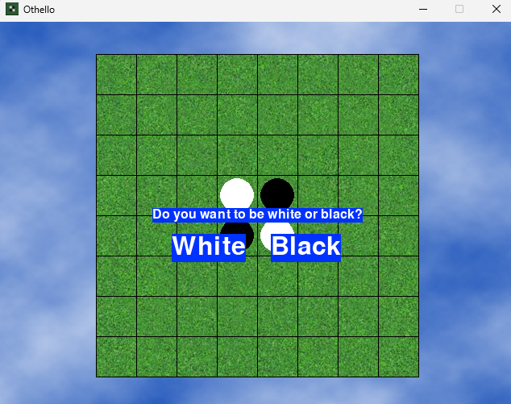

<div align="center">

# Flippy


[](https://github.com/ShivamKR12/Flippy/actions/workflows/build.yml)


</div>

A faithful implementation of the classic Reversi (also known as Othello) board game, developed in Python using the Pygame Community Edition library. Challenge yourself against a computer opponent featuring a simple AI strategy, and enjoy smooth gameplay with intuitive controls and visual feedback!

<div align="center">
  
</div>

## 🚀 Features

*   **Player Choice:** Select to play as either White or Black tiles, allowing for strategic flexibility.
*   **AI Opponent:** Face off against a computer player that employs random move selection for unpredictable gameplay.
*   **Hint System:** Enable visual hints to highlight all valid moves, perfect for beginners or strategic planning.
*   **Smooth Animations:** Enjoy fluid tile-flipping animations that bring the game to life.
*   **Real-Time Feedback:** Track scores and current turn with an on-screen display.
*   **Game Management:** Easily start a new game at any time to practice or replay.
*   **Cross-platform support:** Playable on Windows, macOS, and Linux.

## 🎮 Getting Started

You can easily play the game by downloading the latest executable for your operating system.

1.  Go to the [**Releases**](https://github.com/ShivamKR12/Flippy/releases) page.
2.  Download the appropriate file for your system (Windows, macOS, or Linux).
3.  Run the `flippy` executable.

**Note:** You may need to grant permissions for the application to run on macOS and Linux.

## 🕹️ How to Play

*   **Mouse Click:** Place tiles on the board or interact with on-screen buttons.
*   **ESC Key:** Exit the game immediately.
*   **Hints Button:** Toggle the display of valid move highlights.
*   **New Game Button:** Reset the board and start a fresh game.

**Game Rules:**
*   Choose to play as White or Black at the beginning of the game.
*   Click on an empty square on the board to place your tile. Valid moves will flip one or more of your opponent's tiles.
*   The game concludes when neither player can make a valid move. The player with the most tiles wins.

## 🛠️ Building From Source

If you want to build the game yourself, you'll need Python 3 and some dependencies.

1.  **Clone the repository:**
    ```sh
    git clone https://github.com/ShivamKR12/Flippy.git
    cd Flippy
    ```

2.  **Create a virtual environment (recommended):**
    ```sh
    python -m venv venv
    source venv/bin/activate  # On Windows, use `venv\Scripts\activate`
    ```

3.  **Install dependencies:**
    ```sh
    pip install pygame-ce pyinstaller
    ```

4.  **Run the game:**
    ```sh
    python flippy.py
    ```

5.  **Build the executable:**
    This project uses PyInstaller to create standalone executables.
    ```sh
    pyinstaller flippy.spec
    ```
    The final executable will be in the `dist/` directory.

## 📄 License

This project is licensed under the MIT License. See the [LICENSE](LICENSE) file for details.
